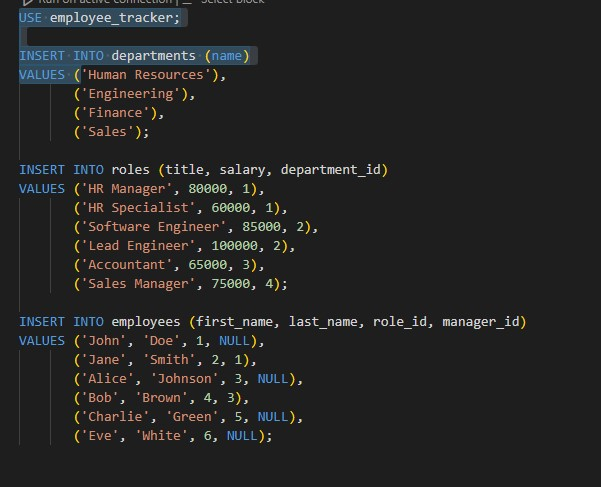
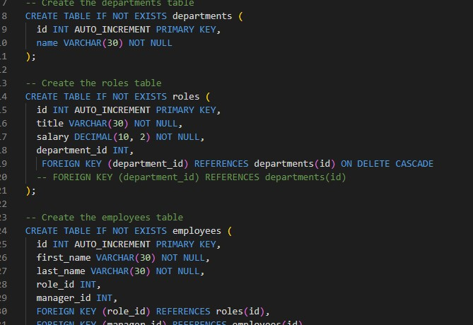

# Employee Tracker 

## Description

This is a interface or Content management system that allows non-developers to view and interact with information stored in databases. It is a command-line application that manages a company's employee database using Node.js, Inquirer, and MySQL. It allows the user to "View all departments", "View all roles","View all employees", "Add a department", "Add a role", "Add an employee", "Update an employee manager","View employees by department",'View employees by manager',  "Update an employee role", "Delete an employee", or  "View department's utilized budget".

## Table of Contents

- [Description](#description)
- [Usage](#usage)
- [Images](#images)

- [Questions](#questions)

## Usage

 [Click here](https://drive.google.com/file/d/1BTasURiCdwW1WSag3HKGqF7cT_vRwE7C/view) to see a video of my application working. 
## Images
This is a example of what the employee list looks like when called 

This is what some of my code looks like 

This is what my schema.sql file looks like 

## Questions

For questions, please contact:

- Email: fanger_austin@yahoo.com    
- GitHub: github.com/Afang911